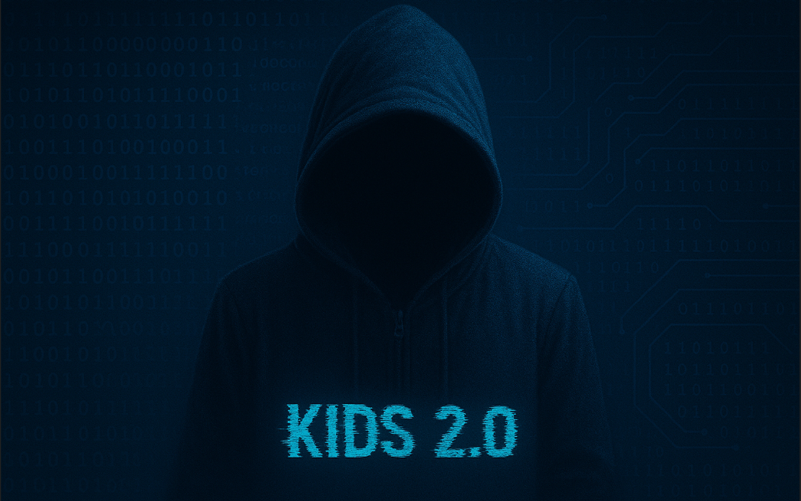

# Kids 2.0 Tasks Writeups

---

Welcome to my personal collection of writeups for `Tasks` on [Kids 2.0](https://web-kids20.forkbomb.ru/).
Each writeup includes my thought process, tools used, exploitation steps, and post-exploitation notes.

Periodically I will return to the laboratories and machines I have completed and make any changes or improvements to my solutions.

---

## Structure

Each writeup is organized in its own directory

---

<h1 align="center">⚠️ Disclaimer ⚠️</h1>

> [!IMPORTANT]
> These writeups are created `for educational purposes only`. Demonstration of tools and various pentesting techniques does not encourage their use outside the legal field.
This repository should be used `only for ethical purposes`: to protect your own systems, improve cybersecurity skills, or within the framework of official agreements.
`The author is not responsible for direct or indirect damage resulting from the illegal use of the presented materials`

---
<h1 align="center"> 💬 Feedback & Contributions </h1>

  
Spotted a mistake? Have suggestions or want to discuss something?

  
I'm always open to feedback and collaboration!

  
  &#8287;&#8287;&#8287;&#8287;&#8287;
 
  &#8287;&#8287;&#8287;&#8287;&#8287;
 
  &#8287;&#8287;&#8287;&#8287;&#8287;
 
  &#8287;&#8287;&#8287;&#8287;&#8287;

